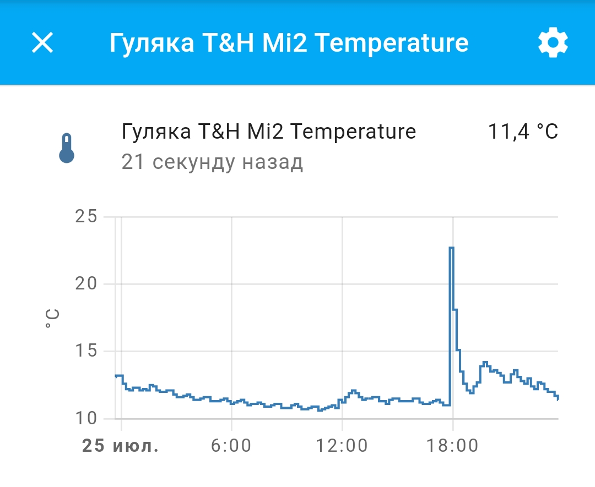

# Python scripts for Home Assistant

## HA_sensor_graph2picture

Обращение к НА с помощью REST API Home Assistant для запроса истории датчика за указанное количество часов, построение графика и сохранение его в файл картинки PNG

